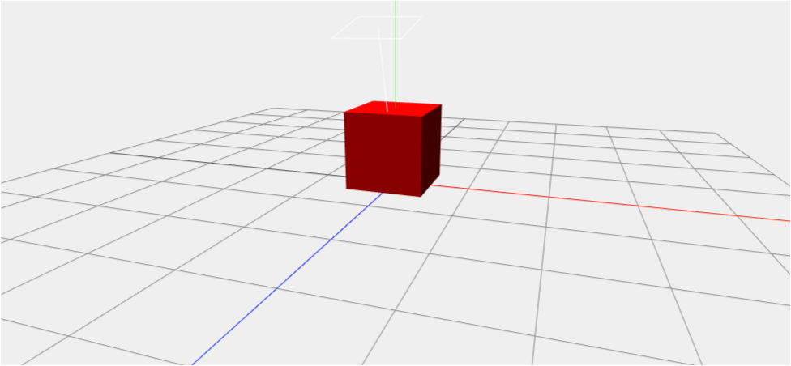
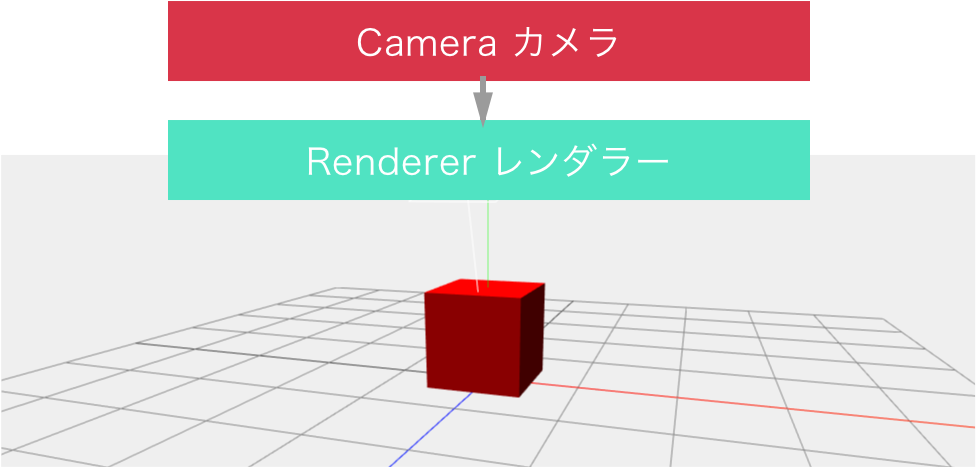

# three.jsの設定
&nbsp;


## HTMLの準備

```
<!DOCTYPE html>
<html lang="ja">
<head>
<meta charset="utf-8">
<title>My first three.js</title>
</head>
<body>
  <div id="stage"></div>
  <script src="https://cdnjs.cloudflare.com/ajax/libs/three.js/89/three.min.js"></script>
  <script>
  // ここに記述
  </script>
</body>
</html>
```


[CDN three.js](https://cdnjs.com/libraries/three.js/)


&nbsp;
&nbsp;

## 3D空間を生成するための3つの仕組み

* シーン　
* カメラ
* レンダリング


&nbsp;
&nbsp;


##  シーン Scene

WebGLにおける仮想3次元空間




```
var scene = new THREE.Scene();
```

&nbsp;
&nbsp;


## カメラ Camera

* 透視投影 PerspectiveCamera
* 正投影 OrthographicCamera

&nbsp;


### 透視投影(PerspectiveCamera)


&nbsp;


#### THREE.PerspectiveCamera

```
var camera = new THREE.PerspectiveCamera( fov, aspect, near, far );
camera.position.set(x,y,z);// 位置
camera.lookAt(scene.position); // カメラの向き
```


* fov (Field of View) 視野角 60~90度が多い
* aspect 縦横比 width/height
* near カメラから視体積の手前までの距離
* far カメラから視体積の奥までの距離

&nbsp;
&nbsp;


## レンダラー renderer

仮想的な3次元空間を 2次元ディスプレイに描画することをレンダリングと呼ぶ。Three.jsではcanvasタグに生成される。



&nbsp;


#### THREE.WebGLRenderer

```
// レンダラーの生成
var renderer = new THREE.WebGLRenderer();
// レンダラーのサイズ
renderer.setSize(800, 600); 
// 背景色
renderer.setClearColor(0xefefef); 
// デバイスピクセル対応
renderer.setPixelRatio(window.devicePixelRatio); 
// DOM（HTML）に配置
document.querySelector('#stage').appendChild(renderer.domElement);
// レンダリングを実行
renderer.render(scene, camera);
```


---