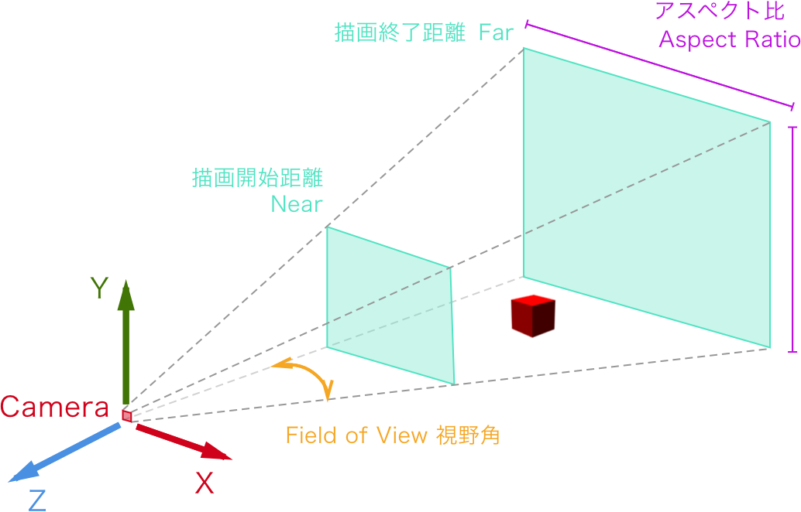
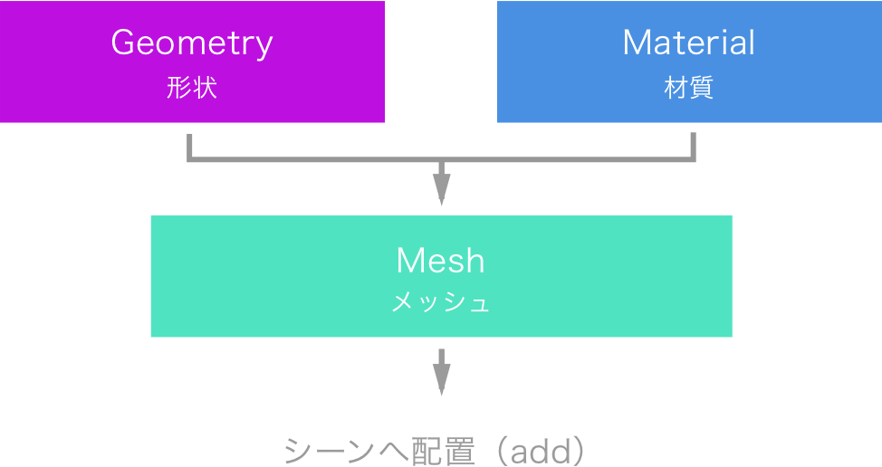
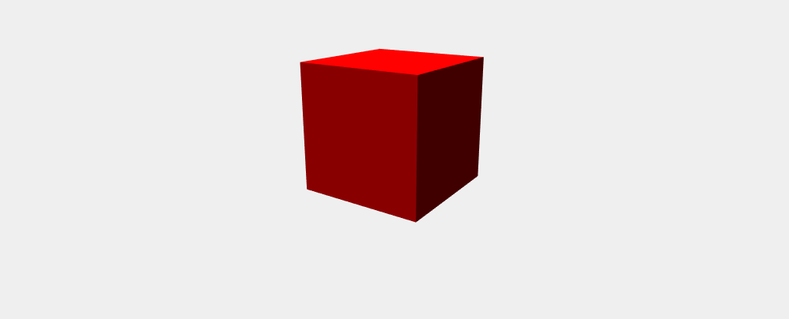
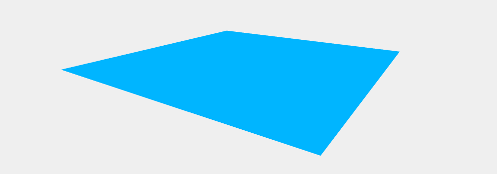
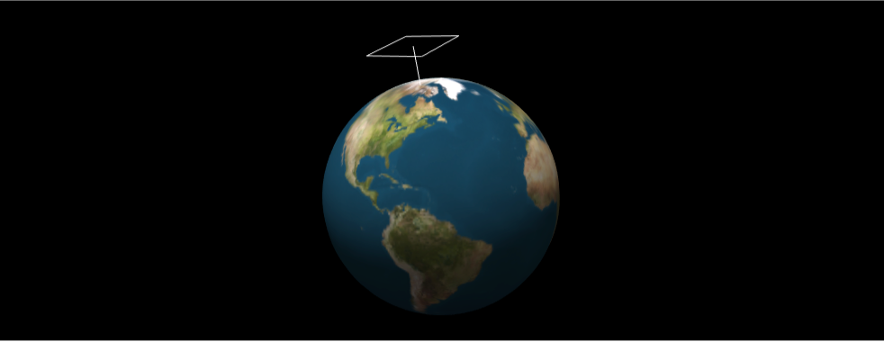

# three.jsの設定
&nbsp;

---

## HTMLの準備

```
<!DOCTYPE html>
<html lang="ja">
<head>
<meta charset="utf-8">
<title>My first three.js</title>
</head>
<body>
  <div id="stage"></div>
  <script src="https://cdnjs.cloudflare.com/ajax/libs/three.js/89/three.min.js"></script>
  <script>
  // ここに記述
  </script>
</body>
</html>
```


&nbsp;

### [CDN three.js](https://cdnjs.com/libraries/three.js/)


---

## 3D空間を生成するための3つの仕組み

* シーン　
* カメラ
* レンダリング


&nbsp;


----

##  シーン Scene

WebGLにおける仮想3次元空間


```
var scene = new THREE.Scene();
```

&nbsp;

---

## カメラ Camera
&nbsp;
* 透視投影 PerspectiveCamera
* 正投影 OrthographicCamera

&nbsp;

---

### 透視投影(PerspectiveCamera)



&nbsp;

---

#### THREE.PerspectiveCamera
&nbsp;

```
var camera = new THREE.PerspectiveCamera( fov, aspect, near, far );
camera.position.set(x,y,z);// 位置
camera.lookAt(scene.position); // カメラの向き
```
&nbsp;

* fov (Field of View) 視野角
* aspect 縦横比 width/height
* near カメラから視体積の手前までの距離
* far カメラから視体積の奥までの距離

&nbsp;

---


## レンダラー renderer

仮想的な3次元空間を 2次元ディスプレイに描画することをレンダリングと呼ぶ。Three.jsではcanvasタグに生成される。


&nbsp;

---


#### THREE.WebGLRenderer
&nbsp;

```
// レンダラーの生成
var renderer = new THREE.WebGLRenderer();
// レンダラーのサイズ
renderer.setSize(800, 600); 
// 背景色
renderer.setClearColor(0xefefef); 
// デバイスピクセル対応
renderer.setPixelRatio(window.devicePixelRatio); 
// DOM（HTML）に配置
document.querySelector('#stage').appendChild(renderer.domElement);
// レンダリングを実行
renderer.render(scene, camera);
```


---


---

# オブジェクトの配置 

---

## Mesh メッシュ 
&nbsp;

3Dオブジェクト。メッシュは形状と材質で構成されている。

* 形状オブジェクト　Geometry
* 材質オブジェクト　Material

&nbsp;


---

### オブジェクトの配置の流れ
&nbsp;



&nbsp;


---

#### THREE.Mesh
&nbsp;
```
var geometry = new THREE.BoxGeometry(50, 50, 50); 
var material = new THREE.MeshNormalMaterial();
var box = new THREE.Mesh(geometry, material);
scene.add(box);
```
&nbsp;
1. Geometryを生成して
2. Materialを生成して
3. GeometryとMaterialをまとめて、Meshを生成
4. Sceneに配置

&nbsp;


---

## Geometry　形状

---

### [THREE.BoxGeometry](https://threejs.org/docs/index.html#api/geometries/BoxGeometry)  



```
var geometry = new THREE.BoxGeometry(50,50,50); // 幅・高さ・奥行き
var material = new THREE.MeshLambertMaterial({color:0xff0000});
var box = new THREE.Mesh(geometry,material);
scene.add(box);
```   

---

#### [THREE.Sphere](https://threejs.org/docs/index.html#api/geometries/SphereGeometry)


```
var geometry = new THREE.SphereGeometry(50, 20, 20), // 直径 頂点の数の幅、高さ
var material = new THREE.MeshLambertMaterial({color:0x4caf50});
var sphere = new THREE.Mesh(geometry,material);
scene.add(sphere);
```


---

#### [THREE.Plane](https://threejs.org/docs/index.html#api/geometries/PlaneGeometry)


```
var geometry = new THREE.PlaneGeometry(200, 200), // 幅・高さ
var material = new THREE.MeshLambertMaterial({color:0x0096d6, side: THREE.DoubleSide}) // 両面を表示するように
var plane = new THREE.Mesh(geometry,material);
plane.rotation.x = THREE.Math.degToRad(90); // 回転
scene.add(plane);
```
---

### その他

* [ConeGeometry](https://threejs.org/docs/index.html#api/geometries/ConeGeometry)
* [CylinderGeometry](https://threejs.org/docs/index.html#api/geometries/CylinderGeometry)
* [TorusGeometry](https://threejs.org/docs/index.html#api/geometries/TorusGeometry)

3DモデリングしたOBJファイルを読み込むこともできる

---

## Material　材質

---


### Materialの種類

* [MeshBasicMaterial](https://threejs.org/docs/index.html#api/materials/MeshBasicMaterial)
	* ライティングを考慮しない陰がつかないマテリアル 
* [MeshNormalMaterial](https://threejs.org/docs/index.html#api/materials/MeshNormalMaterial)
	* ノーマルのカラーをRGBで可視化するマテリアル	
* [MeshLambertMaterial](https://threejs.org/docs/index.html#api/materials/MeshLambertMaterial)
	* 光沢感のないマットな質感。陰影を必要とするのでライトが必要	
* [MeshPhongMaterial](https://threejs.org/docs/index.html#api/materials/MeshPhongMaterial)
	* 光沢感のある質感

---

### Materialの設定


```
var sphere = new THREE.Mesh(
    new THREE.SphereGeometry(50, 20, 20),
    new THREE.MeshPhongMaterial({color:0x4caf50})
);
scene.add(sphere);
```

---


### ワイヤーフレーム表示


```
new THREE.MeshPhongMaterial({color:0x4caf50, wireframe:true})
```


---


## テクスチャ


```
var loader = new THREE.TextureLoader();
var texture = loader.load('img/earthmap1k.jpg');
var sphere = new THREE.Mesh(
  new THREE.SphereGeometry(80, 40, 40),
  new THREE.MeshLambertMaterial({map:texture})
);
```

----


---

# 光源 light

---

## light の種類

* AmbientLight 環境光源
* DirectionalLight 平行光源
* PointLight 点光源
* SpotLight スポットライト光源

---

## [THREE.AmbientLight](https://threejs.org/docs/index.html#api/lights/AmbientLight)

&nbsp;

```
// 環境光源
var light = new THREE.AmbientLight(0x404040); //光の色
scene.add(light);
```

---

## [THREE.DirectionalLight](https://threejs.org/docs/index.html#api/lights/DirectionalLight)

&nbsp;

```
// 平行光源
var directionalLight = new THREE.DirectionalLight(0xffffff, 1); //光の色、光の強さ
directionalLight.position.set(0,100,30);
scene.add(directionalLight);

```


---


### 影


```
renderer.shadowMap.enabled = true;　// レンダラーに影を描画する設定
light.castShadow = true; // ライトに影を出す指定
// 影のサイズを広げる
light.shadow.camera.left = -200;
light.shadow.camera.right = 200;
light.shadow.camera.top = 200;
light.shadow.camera.bottom = -200;
sphere.castShadow = true; // 影を作る対象
plane.receiveShadow = true; // 影を落とす対象
```

----

&nbsp;

---


# アニメーション

---

## position　座標

```
box.position.set(100,0,0);
```

&nbsp;

```
box.position.x = 100;
box.position.y = 50;
box.position.y = 20;
```
---


## scale　拡大縮小

```
box.scale.set(2,1,0.5);
```
&nbsp;

```
box.scale.x = 2;
box.scale.y = 2;
box.scale.z = 0.5;
```

---

## rotation　回転

```
box.rotation.set(THREE.Math.degToRad(70),0,0);
```

&nbsp;

```
box.rotation.x = THREE.Math.degToRad(45);
```
&nbsp;

[THREE.Math](https://threejs.org/docs/index.html#api/math/Math)

---

## requestAnimationFrame

```
function tick(){

  // tick関数をrequestAnimationFrameで連続実行
  requestAnimationFrame(tick);

  // ここにアニメーションの指定を記述する


  // レンダリング
  renderer.render(scene, camera);
}

tick(); // tick関数を実行
```

---

## アニメーション: オブジェクトを回転


```
function tick(){

  // tick関数をrequestAnimationFrameで連続実行
  requestAnimationFrame(tick);

  // boxのY軸回転をインクリメント
  // boxをグローバル変数に変更する
  box.rotation.y += 0.01;

  renderer.render(scene, camera); // レンダリング
}

tick(); // tick関数を実行
```

----


## アニメーション: カメラを回転


```
var angle = 0; // 角度の値を保持する変数

function tick(){
  // tick関数をrequestAnimationFrameで連続実行
  requestAnimationFrame(tick);

  // 角度をインクリメント
  angle += 0.1;
  
  // カメラの軌道
  camera.position.x = Math.cos(THREE.Math.degToRad(angle)) * 300;
  camera.position.z = Math.sin(THREE.Math.degToRad(angle)) * 300;
  camera.lookAt(scene.position); // 原点方向を向く
  
  renderer.render(scene, camera); // レンダリング
}
tick(); // tick関数を実行
```

---

---

# グループ

---


## THREE.Group　グループ
```
var boxes = new THREE.Group();
  for (var i = 0; i < 20; i++) {
    box = new THREE.Mesh(
      new THREE.BoxGeometry(10,10,10),
      new THREE.MeshLambertMaterial({color: Math.random() * 0xffffff})
    );

    box.position.set(
      Math.random() * 100 - 50,
      Math.random() * 100 - 50,
      Math.random() * 100 - 50
    );
    boxes.add(box);
  }
scene.add(boxes);
```


---

---

# Particle　粒子

---

## THREE.Vector3

```
var particle = new THREE.Vector3(0,0,0);
```
* XYZ座標を一つの変数に保持できる
* 座標間距離を測るなどベクトルとして使用

---

## THREE.Points

```
var geometry = new THREE.Geometry(); // ジオメトリ
for ( var i = 0; i < 10000; i ++ ) {
  var star = new THREE.Vector3(
    THREE.Math.randFloatSpread(500); X座標を-500〜500間でランダム
    THREE.Math.randFloatSpread(500); Y座標を-500〜500間でランダム
    THREE.Math.randFloatSpread(500); Z座標を-500〜500間でランダム
  );
  geometry.vertices.push(star); // ジオメトリの頂点データを追加
}
var material = new THREE.PointsMaterial( { color: 0x00ff00 } );
var mesh = new THREE.Points(geometry,material);
scene.add(mesh);
```

---

## THREE.PointsMaterial
```
var material = new THREE.PointsMaterial({
  size: 2, // サイズ
  transparent: true, // 透過
  opacity: 0.8, //　透明度
  //map: texture,
  sizeAttenuation: true, //パーティクルの大きさ
  color: 0x00ff00 // 色
});
```

---

---


# Helper / OrbitControls

---

### THREE.GridHelper

```
var gridHelper = new THREE.GridHelper(200,50);
scene.add(gridHelper);
```
&nbsp;

### THREE.AxisHelper

```
var axisHelper = new THREE.AxisHelper(1000);
scene.add(axisHelper);
```

---

## [DirectionalLightHelper](https://threejs.org/docs/index.html#api/helpers/DirectionalLightHelper)



```
var lightHelper = new THREE.DirectionalLightHelper(light,20);
scene.add(lightHelper);
```
---

## OrbitControls

Scriptファイルの追加読み込み

`<script src="js/OrbitControls.js"></script>`

```
var controls = new THREE.OrbitControls(camera);
```
---

## OrbitControls

```
controls = new THREE.OrbitControls(camera);
controls.autoRotate = true; // カメラの自動回転

function tick(){
    requestAnimationFrame(tick);
    controls.update(); // controlsをアップデートさせる
    renderer.render(scene, camera);
}
tick();
```
---